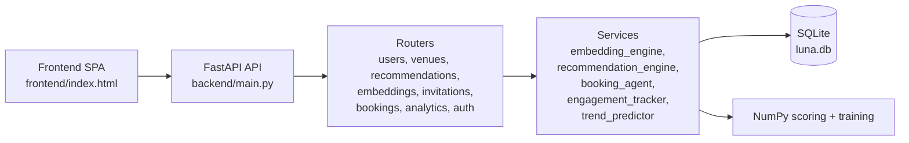
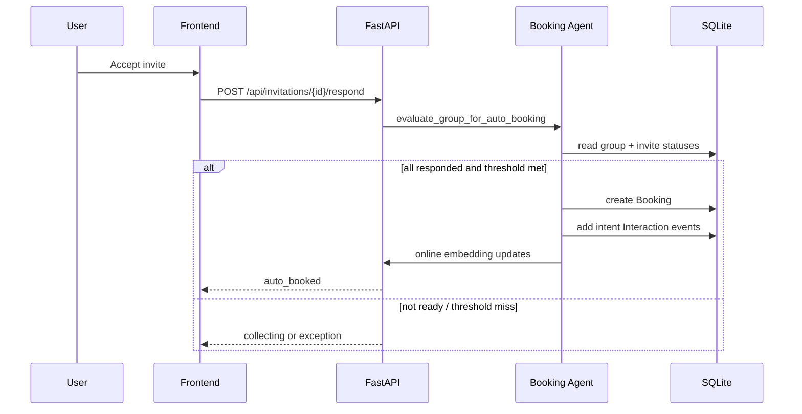

# Luna Social

Social meetup intelligence web app with:

- trainable user and venue embeddings
- explainable recommendation outputs
- invite orchestration with auto-booking
- direct solo and pair booking flows
- trend analytics and activity tracking

This README is a full project handoff: setup, architecture, algorithms, API map, design decisions, AI/template disclosure, and third-party citations.

## 1) What This System Does

Luna models each user and venue in embedding space and uses those vectors to:

- rank venues for each user
- recommend compatible people
- generate pair-specific venue suggestions
- explain recommendations in human-readable concepts

Users can:

- discover venues
- plan a group meetup via invites
- book directly solo
- book directly with one friend
- monitor bookings, including manual review exceptions

## 2) Core Features

- Discover feed with explainable recommendations
- Taste Lab with:
  - top concept activations
  - narrative profile summary
  - recent embedding drift and concept deltas
- Friends page:
  - existing friends
  - recommended people
  - pair planner (suggest places + invite or direct book)
- Invite workflow:
  - organizer sends invites
  - invitees accept or decline
  - auto-booking trigger when all responses are in and threshold is met
- Booking workflow:
  - direct solo booking
  - direct pair booking
  - manual review actions if provider simulation fails
- Trend and engagement analytics
- Search:
  - global search for people and venues
  - profile switch search

## 3) Architecture

### 3.1 High-Level Components




### 3.2 Request/Data Flow




### 3.3 Why This Architecture

- Monolithic FastAPI backend:
  - fast to ship for take-home scope
  - easier debugging and demo setup
- Service-layer separation:
  - recommendation, embeddings, booking logic isolated from transport layer
- SQLite with WAL mode:
  - zero external DB dependency for demo portability
  - enough for local synthetic-scale load
- Static frontend mounted by backend:
  - no frontend build chain needed for demo

## 4) Data Model Summary

Key entities:

- `User`, `Venue`
- `Friendship`
- `Interaction` (view, save, share, checkin, intent, invite_accept, invite_decline, etc.)
- `Interest`
- `InvitationGroup`, `Invitation`
- `Booking`

State highlights:

- `InvitationGroup.status`: collecting, auto_booked, exception, cancelled
- `Booking.status`: confirmed, needs_manual_review, cancelled

## 5) Algorithms and Scoring

### 5.1 Embedding Training (Offline)

Implemented in `backend/services/embedding_engine.py`.

Pipeline:

1. Build cold-start priors for users and venues from metadata:
  - category, cuisine tags, vibe tags, price level, time-slot preferences, archetype
2. Initialize latent factors around priors.
3. Train with implicit feedback using BPR-style pairwise ranking updates:
  - positives from weighted interactions
  - sampled negatives from unobserved venues
4. Apply regularization and periodic prior blending.
5. Persist vectors and concept metadata.

Current defaults (from `backend/config.py`):

- `EMBEDDING_DIM=48`
- `EMBEDDING_EPOCHS=6`
- `EMBEDDING_LR=0.045`
- `EMBEDDING_REG=0.0008`

### 5.2 Online Embedding Updates (Realtime)

Triggered on interactions and bookings.

Mechanism:

- fetch current user vector `u_old` and venue vector `v`
- compute `alpha = ONLINE_UPDATE_ALPHA * abs(weight)`
- positive interactions pull user toward venue
- negative interactions push user away
- update `embedding_meta` with:
  - `latest_drift`
  - `concept_changes`
  - updated narrative

This is what makes recommendation behavior visibly change after bookings/interactions.

### 5.3 Explainability Layer

Concept decomposition:

- concept centroids are computed from venue clusters and feature vectors
- user/venue vectors are projected onto concept centroids
- top activations produce:
  - concept labels
  - normalized strengths
  - recommendation narratives and reasons

### 5.4 Venue Recommendation Score

Main recommender in `backend/services/recommendation_engine.py`.

For each candidate venue:

- embedding similarity
- social proof (friends/mutuals/interested/accepted)
- preference match (cuisine/vibe/price)
- proximity score (Haversine + decay)
- trend score (recent saves, checkins, shares, views)
- novelty score (penalize repeats)
- time-slot match

Weighted blend (defaults):

- embedding: `0.36`
- social: `0.22`
- preference: `0.14`
- distance: `0.11`
- trend: `0.10`
- novelty: `0.07`

### 5.5 Pair Recommendation Score

Pair planner (`get_pair_recommendations`) blends both users:

- pair alignment from both embedding matches
- average preference fit
- travel fairness and distance balance
- social overlap
- trend + novelty
- time-slot compatibility

It also emits shared concept narrative for both users.

### 5.6 Auto-Booking Logic

In `backend/services/booking_agent.py`.

Auto-book trigger:

- all invitees responded
- accepted attendees (including organizer) >= threshold

If trigger passes:

- simulated provider reservation attempt
- success -> booking confirmed
- failure -> `needs_manual_review` and exception path

Manual review actions:

- confirm
- retry_provider
- cancel

### 5.7 Trend Prediction

In `backend/services/trend_predictor.py`.

Signals:

- last 24h interaction mix
- week-over-week momentum
- active interests
- accepted invite counts
- venue rating and popularity prior

Output:

- `trend_score`
- `momentum`
- `predicted_attendance`

## 6) Setup and Run

### 6.1 Prerequisites

- Python 3.10+ (3.11 also works)
- `pip`
- Internet access optional but recommended for:
  - Google Fonts (frontend typography)
  - DiceBear avatar fallback

No Node or frontend build tool is required.

### 6.2 Install Dependencies

From project root:

```bash
cd luna-social
python -m venv .venv
```

Windows PowerShell:

```powershell
.venv\Scripts\Activate.ps1
pip install -r backend/requirements.txt
```

macOS/Linux:

```bash
source .venv/bin/activate
pip install -r backend/requirements.txt
```

### 6.3 Seed Synthetic Data + Train Embeddings

```bash
python -m backend.seed.generate_synthetic_data
```

This resets schema, generates data, runs booking-agent simulation, and trains embeddings.

### 6.4 Run API + Web App

```bash
python -m uvicorn backend.main:app --host 0.0.0.0 --port 8000
```

Open:

- API docs: `http://localhost:8000/docs`
- App: `http://localhost:8000/app`

### 6.5 Quick Smoke Tests

Optional scripts:

```bash
python test_api.py
python test_embeddings.py
python test_invitations.py
```

## 7) Configuration

Config file: `backend/config.py`

Main environment variables:


| Variable                    | Default                 | Purpose                            |
| --------------------------- | ----------------------- | ---------------------------------- |
| `DATABASE_URL`              | `sqlite:///.../luna.db` | DB connection                      |
| `SEED_RANDOM_STATE`         | `42`                    | deterministic synthetic generation |
| `NUM_SEED_USERS`            | `700`                   | synthetic user count               |
| `NUM_SEED_VENUES`           | `220`                   | synthetic venue count              |
| `NUM_SEED_INTERACTIONS`     | `90000`                 | synthetic interaction volume       |
| `EMBEDDING_DIM`             | `48`                    | latent dimension                   |
| `EMBEDDING_EPOCHS`          | `6`                     | training epochs                    |
| `EMBEDDING_LR`              | `0.045`                 | optimizer step size                |
| `EMBEDDING_REG`             | `0.0008`                | regularization                     |
| `ONLINE_UPDATE_ALPHA`       | `0.14`                  | online update magnitude            |
| `AUTO_BOOKING_MIN_ACCEPTED` | `2`                     | minimum accepted attendees         |


## 8) API Surface (Key Endpoints)

Auth:

- `POST /api/auth/oauth-signin` (OAuth-ready shim contract)

Users/Friends:

- `GET /api/users`
- `GET /api/users/{user_id}`
- `GET /api/users/{user_id}/friends`
- `POST /api/users/{user_id}/friends/{friend_id}`
- `DELETE /api/users/{user_id}/friends/{friend_id}`

Embeddings/Recommendations:

- `GET /api/embeddings/taste-profile/{user_id}`
- `GET /api/embeddings/recommend/{user_id}`
- `GET /api/embeddings/people/{user_id}`
- `POST /api/embeddings/interact`
- `GET /api/recommendations/{user_id}`
- `GET /api/recommendations/{user_id}/people`
- `GET /api/recommendations/{user_id}/pair/{other_user_id}`

Invitations:

- `POST /api/invitations/send`
- `GET /api/invitations/incoming/{user_id}`
- `GET /api/invitations/outgoing/{user_id}`
- `POST /api/invitations/{invitation_id}/respond`

Bookings:

- `GET /api/bookings/user/{user_id}`
- `POST /api/bookings/solo`
- `POST /api/bookings/direct`
- `POST /api/bookings/{booking_id}/manual-review`
- `POST /api/bookings/{booking_id}/cancel`

Analytics:

- `POST /api/analytics/track`
- `GET /api/analytics/trending`
- `GET /api/analytics/venue/{venue_id}/engagement`
- `GET /api/analytics/user/{user_id}/activity`

## 9) UX and Design Decisions

- Confirmation dialogs before booking-sensitive actions:
  - solo booking
  - group booking
  - invite acceptance when auto-booking may trigger
- Booking-first intent for solo:
  - "Book Solo" performs booking directly instead of storing intent only
- Explainability-first interface:
  - every user has visible concept profile and recent drift summary
- Single-page frontend:
  - intentionally no framework dependency for portability

## 10) Templates and Coding Agent Disclosure

Templates/starter kits:

- No external project template or boilerplate starter repository was used.

Coding agents used:

- OpenAI Codex (GPT-5 coding agent) was used as an implementation assistant for:
  - architecture refactor and feature expansion
  - bug fixing and API/frontend integration
  - test/smoke validation scripts
  - documentation authoring (this README)

Validation approach:

- endpoint-level smoke tests via local scripts and FastAPI TestClient
- manual UI verification through `/app`

## 11) Third-Party Resources and Citations

Runtime libraries (direct dependencies):

- FastAPI: [https://fastapi.tiangolo.com/](https://fastapi.tiangolo.com/)
- Uvicorn: [https://www.uvicorn.org/](https://www.uvicorn.org/)
- SQLAlchemy: [https://www.sqlalchemy.org/](https://www.sqlalchemy.org/)
- Pydantic: [https://docs.pydantic.dev/](https://docs.pydantic.dev/)
- NumPy: [https://numpy.org/](https://numpy.org/)
- SciPy: [https://scipy.org/](https://scipy.org/)
- NetworkX: [https://networkx.org/](https://networkx.org/)
- Faker: [https://faker.readthedocs.io/](https://faker.readthedocs.io/)
- python-dateutil: [https://dateutil.readthedocs.io/](https://dateutil.readthedocs.io/)
- HTTPX: [https://www.python-httpx.org/](https://www.python-httpx.org/)
- aiosqlite: [https://aiosqlite.omnilib.dev/](https://aiosqlite.omnilib.dev/)

Frontend external resources:

- Google Fonts (Sora, Space Grotesk): [https://fonts.google.com/](https://fonts.google.com/)
- DiceBear avatars (fallback): [https://www.dicebear.com/](https://www.dicebear.com/)

Algorithm references:

- BPR-style implicit ranking inspiration:
Rendle et al., "BPR: Bayesian Personalized Ranking from Implicit Feedback"
[https://arxiv.org/abs/1205.2618](https://arxiv.org/abs/1205.2618)
- Haversine distance formula:
[https://en.wikipedia.org/wiki/Haversine_formula](https://en.wikipedia.org/wiki/Haversine_formula)

## 12) Limitations and Next Steps

Current limitations:

- mock booking provider only (no real reservations API integration)
- auth is OAuth-ready shim, not full production OAuth flow
- no background job queue; booking and updates run inline
- SQLite chosen for demo speed, not production scale

Recommended next steps:

- real booking provider adapters with retries and idempotency keys
- Redis/Celery or equivalent for async workflows
- Postgres migration and indexing strategy for scale
- A/B testing framework for recommendation weights
- stricter auth/session management and role controls

